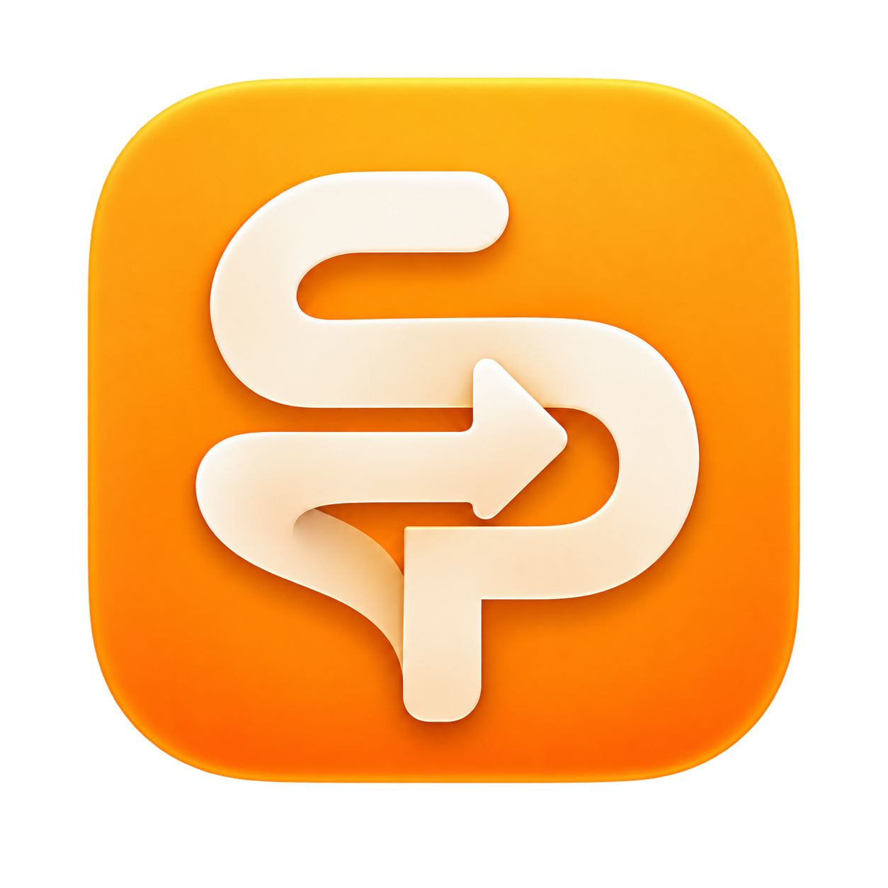
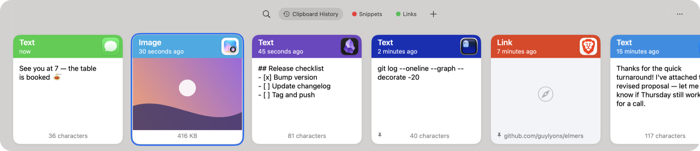
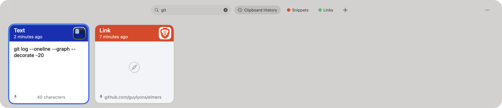
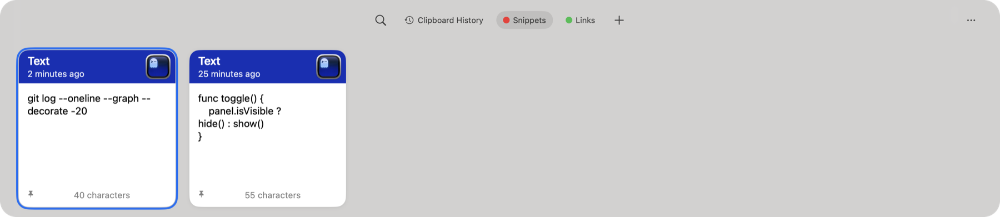
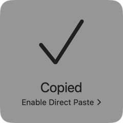
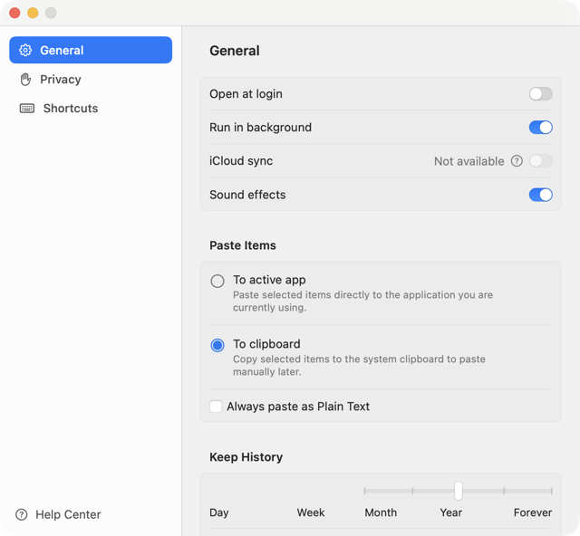

<p align="center">
  
</p>

<h1 align="center">Elmers</h1>

<p align="center">
  <strong>A native macOS clipboard manager that remembers everything you copy.</strong><br>
  Swift · SwiftUI + AppKit · no dependencies · history stays on your Mac
</p>

<p align="center">
  
  
  
  
</p>

<p align="center">
  
</p>

Press **⇧⌘V** from anywhere and your clipboard history slides up from the bottom of the screen as a row of cards. Each card shows what you copied, which app it came from and when. Pick one and it goes back on your clipboard, or straight into the app you're using.

Elmers is modeled closely on [Paste](https://pasteapp.io) and uses it as the spec for how things should look and behave. It's a work in progress and doesn't match Paste completely yet. See [what's left](#roadmap).

> Elmers is an independent project. It is not affiliated with or endorsed by Paste or its developers.

## Features

### Everything you copy, in one place
- **Captures text, rich text, links, images and files** with all their pasteboard formats, so a paste keeps its formatting.
- **Cards show where each item came from**: the header takes its color from the source app's icon, with the content type and a relative time.
- **Previews for everything**: formatted text, image thumbnails, link cards and character or size counts. Press **Space** for a full Quick Look–style preview.

### Find anything fast


- **Type to search** as soon as the panel opens. Arrow keys still move between results, so you can type, arrow and press Return without touching the mouse.
- **Filter by type as you type**: typing `image`, `link`, `file` or `text` turns the word into a filter pill. Filters for app and date are in the search toolbar.
- **On-device OCR** makes text inside screenshots and images searchable. Nothing leaves your Mac.

### Pinboards


- **Keep snippets you use often** on colored pinboards. Pinned items never expire.
- Rename, recolor and drag-reorder pinboards. Switch between them with **⌘←** and **⌘→**.

### Paste your way


- **Clipboard mode** (the default) puts the item on the clipboard and shows a brief *Copied* confirmation. Then press ⌘V wherever you like.
- **Direct paste** sends the item straight into the frontmost app. It needs Accessibility access.
- **⇧Return** pastes as plain text. **⌘1…⌘9** paste one of the first nine items.
- **Multi-select** to copy, paste, pin or delete several items at once. Undo and redo cover history edits.

### Edit and create
- **⌘N** creates a new text item and **⌘E** edits the selected one in a floating editor with bold, italic, underline, strikethrough and Writing Tools.
- A card's context menu has Paste, Copy, Edit, Rename, Delete, Pin, Preview and Share.

### Private by default


- History is stored **only on this Mac**, in an atomically written archive.
- Items marked **confidential or transient** (for example, from password managers) are skipped by default.
- **Ignore specific apps.** Keychain Access and Passwords are excluded out of the box.
- **Hide from screen sharing** and **pause capture** for 15 minutes to 8 hours.
- **Link previews are off** until you turn them on, so Elmers makes no network requests until then.
- Set how long history is kept, from one day to forever, and remap every shortcut in Settings.

<br clear="right">

## Keyboard shortcuts

| Shortcut | Action |
|---|---|
| **⇧⌘V** | Show or hide the history panel (from any app) |
| **← / →** | Move between cards |
| **Return** / double-click | Paste the selected item |
| **⇧Return** | Paste as plain text |
| **⌘1 … ⌘9** | Paste one of the first nine items |
| **Space** | Preview the selected item |
| **⌘C** | Copy the selected item |
| **⌘F** or start typing | Search |
| **⌘← / ⌘→** | Previous or next pinboard |
| **⇧⌘N** | New pinboard |
| **⌘N** / **⌘E** | New text item / edit the selected item |
| **⌘T** | Pause capture |
| **⌘,** | Settings |
| **Esc** | Close the panel |

Left-click the menu bar icon to show or hide history. Right-click it to open Settings.

## Install

Elmers is built from source. It needs **macOS 14 or later** and **Swift 5.9+**. The Xcode Command Line Tools are enough, and there are no third-party packages.

```sh
git clone https://github.com/guylyons/elmers.git
cd elmers
./scripts/build-app.sh          # add "release" for an optimized build
open dist/Elmers.app
```

Elmers lives in the menu bar. Copy something in another app and press **⇧⌘V**.

> [!NOTE]
> Only one app can own ⇧⌘V at a time. If Paste or another clipboard manager is running, quit it and click Elmers' menu bar icon to register the shortcut again. Conflicts are shown in Settings › Shortcuts.

> [!TIP]
> The Command Line Tools 27.0 macOS 27 SDK is missing SwiftUI's `@State` macro plugin. If you have the macOS 26 SDK installed, `scripts/swift.sh` uses it automatically. Set `SDKROOT` to use a different SDK.

## Testing

```sh
./scripts/test.sh                                   # core checks
.build/debug/Elmers --demo --check-interaction      # drives the real panel with synthetic content
```

The core checks are a standalone Swift executable because the Command Line Tools don't include XCTest. They cover real history and archive behavior, capture policy, keyboard routing, and pasteboard round trips on uniquely named pasteboards, so your actual clipboard is never touched. The `--demo` interaction check sends real AppKit events to the panel using in-memory content only.

## Project layout

```
Sources/
  ElmersCore/     History, archive, capture policy, search, keyboard model, pasteboard codec
  Elmers/         The app: panel, cards, settings, editor, shortcuts, OCR, sounds
Tests/            ElmersCoreChecks: the core check runner
Resources/        Info.plist, app icon and menu bar artwork
scripts/          build-app.sh, swift.sh, test.sh
docs/             Paste parity inventory and development checkpoints
```

## Data

- History: `~/Library/Application Support/Elmers/history.sqlite`, private to your account, excluded from Time Machine, and wiped as you delete items.
- History is limited by age only, as in Paste (Settings › General › Keep History, Day through Forever), and up to 32 MB per capture. Large content stays on disk until it is shown, pasted or dragged, so a long history does not have to fit in memory. File URLs are stored as references, so Elmers doesn't back up the files themselves.
- If the history can't be read, Elmers leaves the database untouched and stops capturing so it never overwrites your history.

## Roadmap

Elmers tracks its progress against Paste in [docs/paste-parity.md](docs/paste-parity.md). The biggest gaps:

- [ ] **Paste Stack**: copy several items, then paste them in sequence
- [ ] **Drag and drop** in the built app, both cards into other apps and reordering pinboards
- [ ] A custom **About** window with the character artwork
- [ ] A search layout that matches Paste's
- [ ] Scalable storage for very large histories
- [ ] iCloud sync across devices
- [ ] Full visual, accessibility and localization parity

Current status and verification notes: [docs/HANDOFF.md](docs/HANDOFF.md). Known issues: [issues.md](issues.md).
